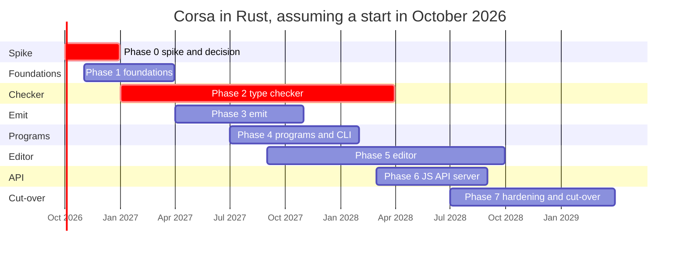

# Corsa in Rust

Engineering plan, draft 1, 5 September 2026. Measured against microsoft/TypeScript at commit `1f70213d49`.

A phased plan to replace the Go implementation of the TypeScript 7 compiler and language server (the `tsc/` module, codename Corsa) with a Rust implementation that ships as a drop-in `tsc` binary: the same 48,075 baseline files, the same LSP and JS-API wire protocols, the same npm and VS Code distribution.

| | |
|---|---|
| Source to replace | 317,820 lines of Go across 82 packages, of which 47,442 are generated; 5,082 Go files; no cgo; twelve files of `unsafe` confined to file watching and paths |
| Tests to satisfy | 12,721 compiler and conformance cases producing 48,075 baselines; 4,356 fourslash tests (761,930 lines of Go); tsc, build, watch, project, LSP and JS-API suites; 342 MB of test data |
| Wire contracts to keep | LSP 3.17 over stdio; the `--api` protocol (msgpack framing, binary AST encoder version 8, 144 methods); the content-mapper plugin RPC |
| Upstream to track | 113 to 237 commits per month during 2026, about fifteen regular contributors, roughly a quarter of commits agent-authored |
| Central estimate | 30 months with a team of ten, about 25 engineer-years; go/no-go decision after a ten-week spike, not now |

## Contents

1. [The short version](#1-the-short-version)
2. [Why do it at all](#2-why-do-it-at-all)
3. [What is in the repository](#3-what-is-in-the-repository)
4. [What makes this hard](#4-what-makes-this-hard)
5. [Goals and exit criteria](#5-goals-and-exit-criteria)
6. [Architecture decisions](#6-architecture-decisions)
7. [Compatibility contracts](#7-compatibility-contracts)
8. [Strategy and crate map](#8-strategy-and-crate-map)
9. [Phases and timeline](#9-phases-and-timeline)
10. [Risk register](#10-risk-register)
11. [Deliberately not rewritten](#11-deliberately-not-rewritten)
12. [Alternatives considered](#12-alternatives-considered)
13. [Open questions](#13-open-questions)
14. [First thirty days](#14-first-thirty-days)

## 1. The short version

1. **This is a rewrite in the hard third and a port in the easy two thirds.** The Go code is a near line-for-line translation of the original TypeScript source kept alive by a garbage collector: nodes, symbols, types and the checker form cyclic, lazily mutated pointer graphs, and the checker keys dozens of caches by pointer identity. Rust cannot express that shape. The checker's data layer and the project system's snapshots must be re-architected onto arenas and integer ids while their control flow is preserved line by line. Scanner, parser, binder, printer, transformers, module resolution, the command line and the formatter port mostly mechanically once the AST design exists.
2. **The TypeScript team evaluated Rust for this codebase in 2024 and chose Go for exactly that reason.** Their reasoning still holds. The plan's job is to bound the cost and to make the decision on evidence from a spike rather than on conviction.
3. **The test corpus makes it tractable.** The inputs and baselines are language-agnostic text, and three harness seams (the binary AST encoding, LSP over stdio, and the JS-API test suite that spawns the binary) let the Go binary act as an oracle for the Rust one from the first week.
4. **The critical path is the checker** (60,703 lines, one 32,523-line file, 2,885 functions, a struct with about 320 fields), followed by the language service (41,500 lines) and the project system (12,300 lines). Emit, the command line and the API server run as parallel workstreams.
5. **Evaluation order is part of the contract.** Union constituents are sorted by type id, so the order in which the checker creates types is visible in every `.types` baseline, in hover text and in declaration emit. A Rust checker that creates types in a different order is wrong even when its answers are right.
6. **Estimate: 30 months with ten engineers.** Twenty-four if the spike shows velocity close to the Go port's; thirty-six or more if it does not. The Go port took 23 months (30 September 2024 to 19 August 2026) with the TypeScript team doing a one-to-one translation with heavy AI assistance. Treat that as the floor.
7. **Without the TypeScript team's sponsorship this is a fork of a 300,000-line moving target.** The precedent is `stc`, an earlier Rust port of the checker abandoned in 2023. Step one is the decision memo and sponsorship, not the first crate.

## 2. Why do it at all

Corsa already captured the large win of leaving JavaScript. Rust competes with Go, not with the old compiler, so the case has to rest on things Go cannot give this project.

- **In-process embedding.** The Rust tools that now dominate the JavaScript toolchain (oxc, rolldown, rspack, turbopack, biome, deno) can link a Rust checker directly instead of driving the `--api` server over a socket. Today anything that wants in-process access must itself be written in Go, which is why the typescript-eslint native linter is a Go program.
- **WebAssembly.** A `wasm32` build of the compiler for the playground, browsers and hosts that cannot spawn native processes. Go's WebAssembly output is large and slow, so Corsa has no such story and the JS API requires a native binary.
- **Memory and tail latency.** Arena-owned type universes free wholesale, there is no collector headroom (Go's collector by default lets the heap grow to twice the live set between collections), and no collection pauses inside editor requests. Expect 30 to 50 percent lower peak memory. CPU gains of 1.2 to 2 times are plausible from data layout but not guaranteed; the spike measures them.
- **Compile-time concurrency rules.** "Never mix types from different checkers" and "requests run on immutable snapshots" are comments and race-detector CI jobs today. With `Send` and `Sync` they become facts the compiler enforces.
- **Portability without cgo tricks.** Corsa reaches FSEvents on macOS through a hand-rolled, cgo-free foreign function layer. Rust reaches system APIs natively on every target.

What it does not buy: correctness, features, or speed over TypeScript 6. Those are already delivered, and every month spent here is a month not spent on them.

## 3. What is in the repository

Non-test Go lines per area, measured on this commit. Generated code is counted separately because it is regenerated from a schema rather than rewritten.

| Area | Go packages | Lines | Notes |
|---|---|---:|---|
| Type checker | `checker` | 60,703 | `checker.go` alone is 32,523 lines; `relater.go` 5,044; `flow.go` 2,761; node builder 3,705. 2,885 functions. |
| Language service | `ls`, `ls/autoimport`, `ls/lsutil`, `ls/change`, `ls/lsconv` | 41,536 | Completions 6,900 lines, string completions 2,247, find-all-references 2,774, auto-import registry 5,400. |
| Emit | `printer`, `transformers/*`, `sourcemap` | 37,163 | ES transforms 11,251 (class fields 3,618, decorators 2,751); declaration transform 4,212; TS, module and JSX transforms 7,813. |
| AST | `ast` | 21,219 | 10,058 lines generated from `tools/scripts/tsc/ast.json`; utilities 4,631; pointer-based nodes with parent links and per-kind arenas. |
| Program, options, resolution | `compiler`, `tsoptions`, `module`, `modulespecifiers`, `packagejson`, `outputpaths` | 19,236 | Program construction, checker pool (FENNEL partitioning), about 160 compiler options, node and bundler module resolution. |
| LSP protocol types | `lsp/lsproto` | 18,325 | 17,566 lines generated from the LSP 3.17 metamodel by `_generate/generate.mts`. |
| Syntax | `parser`, `scanner`, `binder` | 17,002 | Includes the JSDoc reparser that rewrites JSDoc into synthetic TypeScript nodes; positions are UTF-8 byte offsets. |
| Command line, build, watch | `execute/*`, `fswatch`, `diagnosticwriter` | 14,656 | `tsc`, `-b` orchestrator, incremental `.tsbuildinfo`, native watchers for FSEvents, inotify, fanotify, kqueue and Windows. |
| Project system | `project`, `project/ata`, `project/dirty`, `project/logging` | 12,309 | Immutable, reference-counted snapshots built copy-on-write; automatic type acquisition spawns npm. |
| JS API server | `api`, `api/encoder`, `ipc`, `jsonrpc` | 12,168 | 144 methods, msgpack framing, binary source-file encoder (protocol 8), unix sockets and named pipes, callback file system. |
| Diagnostics | `diagnostics` | 9,658 | 8,854 generated from 2,135 messages plus 85 extra; 13 embedded gzipped locales. |
| Formatter | `format` | 4,259 | Rule-based formatter with its own baselines. |
| LSP server | `lsp`, `lsp/lspwatcher` | 3,734 | Request queue with cancellation, progress, watcher registration, API-over-LSP connection, stack sanitizer. |
| Content mappers | `contentmapper`, `spanmap` | 2,795 | Child-process plugins (for example `.vue`) that produce virtual TypeScript over JSON-RPC. |
| Utilities and hosts | `core`, `collections`, `stringutil`, `tspath`, `jsnum`, `vfs/*`, `glob`, `semver`, `json`, `locale`, `bundled`, `astnav`, `evaluator`, `pseudochecker`, `transpile`, `tracing`, `pprof`, others | about 26,000 | Unicode 15.1 identifier tables (3,496 generated lines), JavaScript number semantics, virtual file systems, 108 embedded `lib.*.d.ts` files. |
| Test harnesses (Go, not counted above) | `fourslash`, `testrunner`, `testutil/*`, `execute/tsctests` | about 17,000 | Compiler runner with directive parser and baseline diffing, fourslash LSP client, fake system with clock for tsc tests, project test utilities. |
| **Total non-test Go** | **82 packages** | **317,820** | 47,442 generated; about 270,000 hand-written. |

Alongside the Go module: `packages/typescript`, the npm package and JS API client (53,200 lines of TypeScript, 12,863 generated), `packages/vscode-typescript` (4,184 lines), the hereby build file, generators, and the Azure release pipelines with macOS and Windows signing. None of that is rewritten.

## 4. What makes this hard

### The Go code is a port, and Rust cannot be ported to

Every load-bearing structure in Corsa is a pointer graph with cycles and late mutation. `ast.Node` carries a `Parent` pointer and an interface-typed payload; the binder writes symbols and flow nodes into nodes after parsing; `ast.Symbol` points at its declarations, members, parent and export symbol; `checker.Type` points back at its checker and symbol. The checker itself is a 320-field struct whose caches are maps keyed by `*ast.Node`, `*ast.Symbol` and `*Type`, plus 26 `core.LinkStore` side tables keyed by pointer, plus function-valued fields that swap behavior at runtime. Go's collector frees the whole tangle when the checker is dropped.

None of that survives the borrow checker unchanged. The data layer becomes arenas and ids (which Corsa already half-uses through `core.Arena` and `LinkStore`), and every function that today mutates through a pointer while holding other pointers must be rewritten to work with ids. The control flow can and must stay the same; the plumbing cannot.

### Observable evaluation order

`getUnionType` orders constituents through `compareTypeIds`, and type ids are handed out in creation order. The compiler runner has a dedicated `union ordering` sub-test, and 6,674 `.types` baselines, every hover, every emitted `.d.ts` and every quick-info string print unions in that order. A "cleaner" Rust checker that resolves a type a little earlier or later than Go produces thousands of baseline diffs that are individually harmless and collectively unreviewable. The plan treats creation order as a contract and builds tooling to diff it.

### Deep recursion on fixed stacks

Go stacks grow on demand up to 1 GB, and Corsa never had to think about recursion depth beyond TypeScript's own instantiation limits. Rust threads have fixed stacks and a stack overflow aborts the process. Long binary-expression chains, deeply nested JSX and recursive conditional types will find this on day one unless the design reserves large stacks and guards the deepest paths.

### The target moves

The Go tree received between 113 and 237 commits a month this year from about fifteen regular contributors, with roughly a quarter of commits authored by coding agents. A rewrite that takes two and a half years must absorb roughly 4,000 upstream commits while it is being written. That is a process problem as much as a technical one, and it is why the Rust code should keep Go's file, function and variable names wherever possible: upstream diffs must be transplantable.

### Calibration

The Go port's first commit landed on 30 September 2024. The repository switched to the Go-only layout on 19 August 2026, after 2,546 commits to `tsc/`. That was a one-to-one translation by the people who wrote the original, with the original test suite, and with heavy agent assistance. A Rust rewrite has the same suite and can use the same assistance, but it pays for the re-architecture and for two years of tracking. Twenty-three months is therefore the floor for the estimate, not a comparable.

## 5. Goals and exit criteria

### Goals

- A single `tsc` binary that replaces the Go one in `built/local`, the npm platform packages and the VSIX without changes to `packages/typescript` or the extension.
- Identical baselines across all suites, with intentional differences recorded in a reviewed allow-list the way `testdata/submoduleAccepted.txt` records Corsa's accepted divergences from TypeScript 6.
- Wire compatibility for LSP, the API protocol and the content-mapper protocol, verified by running the existing clients and test suites unchanged.
- Performance at or above Go on the TypeScript-benchmarking scenarios (vscode, self-compiler, mui-docs, xstate, bluesky) at 2, 4 and 8 checkers, with at most 70 percent of Go's peak memory.
- Upstream parity maintained throughout, with a ledger that maps every Go file to its Rust counterpart and the last synchronized commit.

### Non-goals

- Changing TypeScript semantics, diagnostics text, emit or the differences documented in `tsc/CHANGES.md`. The Rust compiler targets Corsa, not TypeScript 6.
- Rewriting the JS API client, the VS Code extension, the build file, the release pipelines or the test data.
- Adopting a third-party AST or parser. The AST shape is pinned by `ast.json`, the binary encoder and the generated TypeScript AST package.
- New features during the rewrite. Rust follows Go until the checker gate; after it, features land Rust-first only by explicit decision.

### Exit criteria for cut-over

- 100 percent of compiler, conformance, transpile, config, tsc, build and watch baselines, modulo the allow-list.
- At least 99.5 percent of fourslash tests, with the remainder triaged and listed.
- The `packages/typescript` sync and async suites, the project and LSP suites and the replay corpus pass against the Rust binary.
- Benchmark and memory targets met on every scenario for four consecutive weekly runs.
- Four weeks of dogfood in `typescript@next` and the nightly extension behind an implementation switch, with no open P1 crash.

## 6. Architecture decisions

Each decision names what it replaces. The through-line is that Corsa's runtime model is kept wherever it is observable, and only the memory model changes.

### 1. AST: index-based, generated from `ast.json`

- **Decision.** One arena per source file. `NodeId(u32)` into a dense header table (kind, flags, pos, end, parent, payload index) with per-kind payload tables, all emitted by a new `generate-rust-ast.ts` backend next to the existing Go, TypeScript and encoder generators so four artifacts stay in sync from one schema. Children are node ids and node-list ranges. Positions stay UTF-8 byte offsets.
- **Because.** Parent links, lazily attached symbols and flow nodes, and sharing files across programs and snapshots are all trivial with ids. The API encoder (protocol 8) is already an index-based layout with parent and next offsets, so encoding becomes a linear copy.
- **Instead of.** `Rc<RefCell<Node>>` graphs (slow, unergonomic); bump-arena references in the oxc style, `&'a Node<'a>`, which are excellent for parse and transform but push a lifetime into the checker, the language service and long-lived snapshots; adopting oxc's AST outright, whose shape does not match `ast.json`.

### 2. Symbols, types and signatures: checker-owned arenas

- **Decision.** `SymbolId`, `TypeId` and `SignatureId` as `u32` indices. Binder symbols live in a program-wide arena shared read-only by every checker; transient symbols the checker creates live in a per-checker arena, distinguished by a high bit. Every `map[*ast.Node]*Type` and every `LinkStore` becomes a side table keyed by `(FileId, NodeId)` or by id. The `TypeData` and `nodeData` interfaces become enums with per-variant payload tables.
- **Because.** This is the memory model Corsa already uses through `core.Arena` and `LinkStore`, minus the pointers. Dropping a checker frees its whole type universe, which is what the checker pool relies on. The translation of pointer-keyed maps to id-keyed maps is mechanical.
- **Instead of.** `Arc<Type>` graphs (cycles leak, an atomic on every access); a single global arena (breaks the per-checker universes the pool needs and the "never mix types across checkers" rule).

### 3. Mutation inside the checker

- **Decision.** The checker is a single-threaded state machine that takes `&mut self` and never holds a borrow into its arenas across a call: accessors copy small values out, scalar lazily-resolved fields use `Cell`, collections are addressed by id. `isRelatedTo`, instantiation, inference and control-flow analysis keep Corsa's structure and its order of side effects to the line.
- **Because.** Creation order is observable (decision 5). A rewrite that changes when a type is created fails thousands of `.types` baselines in ways that take days to diagnose.
- **Instead of.** `RefCell` on every table (runtime borrow panics inside 32,000 lines of recursion); splitting the checker into pure passes, which does not match TypeScript's demand-driven semantics.

### 4. Concurrency: keep Corsa's model exactly

- **Decision.** Parse and bind in parallel with scoped threads. Partition files across checkers with the same FENNEL heuristic and the same tuned constants from `compiler/checkerpool.go`; one checker per thread, `Send` but not `Sync`. Emit per file in parallel. The language server serves requests on `Arc<Snapshot>` values built copy-on-write, with `project/dirty`'s boxes becoming persistent maps. Cancellation is a token polled wherever Corsa polls its context.
- **Because.** These behaviors have baselines and a race-mode CI job, and the partitioning constants were swept on real projects. There is nothing to gain from a different model before parity.
- **Instead of.** A query-based incremental architecture in the rust-analyzer style. Attractive later; incompatible with landing a drop-in replacement.

### 5. Evaluation order is a contract

- **Decision.** Preserve the order in which types, symbols and signatures are created. Add a creation-trace mode to both binaries that emits the sequence of (kind, symbol, alias) per test, and a diff tool over it, so an ordering regression is located in minutes rather than by reading baselines.
- **Because.** `compareTypeIds` at `checker.go:26994`, the `union ordering` sub-test in the compiler runner, and every `.types`, hover and `.d.ts` baseline.

### 6. Deep recursion

- **Decision.** Run parsing, checking and emit on threads created with large reserved stacks (256 MB to 1 GB; reservation is virtual and committed lazily on every supported platform), and add growth guards in the deepest recursive paths.
- **Because.** Go grows stacks on demand up to 1 GB by default (`core.ApplyDebugStackLimit` only lowers it for debugging). A fixed 8 MB stack would introduce a new crash class that Corsa never had.

### 7. Panics and errors

- **Decision.** Invariants stay `panic!` and `debug_assert!` (Corsa has about 600 panic sites and twelve recovers). Each LSP request, API call and test step runs under `catch_unwind` with the same stack sanitizing as `lsp/stack_sanitizer.go`. Locks are `parking_lot` (no poisoning) and are never held across checker calls. I/O and configuration failures are `Result`.

### 8. Strings, numbers, Unicode and collation

- **Decision.** UTF-8 everywhere, which is already Corsa's position model. Intern identifiers program-wide as `Atom(u32)`, keeping observable iteration orders of symbol tables. Port `jsnum` (JavaScript number formatting and parsing) with a shortest-round-trip printer and golden tests against V8. Regenerate identifier tables from the same Unicode 15.1 data the scanner uses today. Match the `x/text` collation used by organize-imports with `icu_collator` pinned to the same rules.
- **Because.** Each of these is exercised by baselines; drift shows up as thousands of spurious diffs.

### 9. Host seams

- **Decision.** Object-safe, `Send + Sync` traits with the same shapes as `vfs.FS`, `compiler.CompilerHost`, the tsc `System` with its fake clock, `checker.Program` and the content-mapper host.
- **Because.** Every harness injects through these seams. Keeping them identical makes the harness ports mechanical and lets one test corpus drive both implementations.

### 10. Generated code stays single-source

- **Decision.** Add Rust backends to the existing generators: `ast.json` to AST, visitor, factory and encoder; `diagnosticMessages.json` to `diagnostics.rs`, checked in and CI-verified as today; the LSP metamodel to a serde `lsproto` from the existing `generate.mts`. Replace `tools/gen-proto`, which reads Go types through `go/types`, with a declarative `api.json` that emits both the Rust dispatcher and `proto.generated.ts`. Move the enum tables that `generate:enums` scrapes from Go source into the schema files so Go, Rust and TypeScript read one source. Embed libs with `include_str!` behind a `noembed` feature mirroring the Go build tag; keep the 13 locale files gzipped and inflate on demand.

### 11. Crate layout mirrors the Go package graph

- **Decision.** A Cargo workspace under `rust/` in the TypeScript repository, one crate per Go package where the boundary carries meaning, tiny leaves merged into `ts_core`. Test-only packages become test crates. See the crate map below.
- **Because.** Cargo compiles and caches crates independently; a monolithic crate makes the 60,000-line checker the compile-time bottleneck of every change. Staying in that repository keeps 342 MB of test data shared and lets generator, test and implementation changes land in one pull request.

### 12. Toolchain and lints

- **Decision.** Stable Rust, minimum supported version one behind current stable. `clippy` at pedantic minus an allow-list; the custom Go linters (`forbidparentaccess`, `checkchildren`, `bitclear`, `emptycase`, `shadow`, `unexportedapi`) re-implemented as dylint lints. `rustfmt` through the existing dprint configuration. `cargo nextest` for the suites, `mold` or `lld` plus `sccache` in CI. `#![forbid(unsafe_code)]` everywhere except the same leaf crates where Corsa uses `unsafe` today (file watching, paths, platform FFI). Release profile: `panic = "unwind"` (required by decision 7), fat LTO, one codegen unit, mimalloc.

### 13. Distribution and targets

- **Decision.** Keep the npm layout (`typescript` plus `@typescript/typescript-<os>-<arch>` with `lib/tsc`) and the VSIX pipeline. The signing steps (quill and machotool for macOS hardened runtime, the Windows certificate) operate on Mach-O and PE files and do not care what produced them. Cross-compile the seven primary targets in CI with cargo-zigbuild or cross, musl for Alpine.
- **Open.** The thirteen best-effort targets map unevenly onto Rust's support tiers: illumos, riscv64, s390x, ppc64, loongarch64, Android arm64 and FreeBSD x64 have prebuilt standard libraries; NetBSD and OpenBSD arm64, OpenBSD x64, FreeBSD arm64 and mips64el do not. Go builds all twenty from one host. The supported matrix is a Phase 0 decision, not an accident of what happens to compile.

### 14. Dependency policy

- **Decision.** Few, vetted crates, each recorded with the reason it exists. `cargo-deny` enforces license compatibility with the repository's Apache-2.0 license and the existing `NOTICE.txt` process, bans duplicate versions and known advisories; `cargo-vet` records an audit for every crate; `Cargo.lock` is committed; no build script touches the network; the minimum supported Rust version is checked in CI. The expected direct dependencies mirror the roles of Corsa's twelve Go modules: scoped threads or rayon, parking_lot, mimalloc, serde with a JSON crate matched to the Go JSON v2 usage, an msgpack crate, an xxh3 implementation that produces the same hashes the API encoder header carries today, a patience diff for baselines, flate2 for the locale files, icu_collator, stacker, and the platform crates for file watching and named pipes.
- **Because.** The Go module builds without cgo, without Node and with twelve direct dependencies, and CI proves it. A Rust tree that pulls in hundreds of transitive crates would be a regression in auditability that the TypeScript team would rightly refuse.

## 7. Compatibility contracts

What must hold at cut-over, what pins it, and whether the existing verification can be reused as-is, bridged to the Rust binary, or must be ported.

| Contract | Pinned by | Verified with | Reuse |
|---|---|---|---|
| Type-check results: `.errors.txt`, `.types`, `.symbols` | 12,721 cases; 45,447 baseline files under `compiler` and `conformance`; `union ordering` and parent-pointer sub-tests | Ported compiler runner; Go binary as oracle; creation-trace diff | Data as-is; runner ported |
| Emit: `.js`, `.map`, `.d.ts`, source-map records | Same corpus; 41 transpile baselines | Runner sub-tests | Data as-is |
| Command line: `tsc`, `--watch`, `-b`, `--incremental`, pretty output, locales | 517 baselines across `tsc`, `tscWatch`, `tsbuild`, `tsbuildWatch`; `.tsbuildinfo` JSON | Ported `tsctests` harness with fake system and clock | Data as-is; harness ported |
| Configuration parsing | 309 baselines under `config` and `tsoptions` | Ported unit tests | Data as-is |
| Language server over LSP 3.17 | 4,356 fourslash tests; 1,749 fourslash baselines; project and LSP suites; replay corpus | First: Go fourslash suite bridged to an out-of-process Rust server. Later: suite regenerated in Rust from the original fourslash sources | Bridge, then regenerate |
| JS API: msgpack framing, encoder protocol 8, 144 methods, snapshots, batches, callback FS | `packages/typescript` sync and async suites and benchmarks; `api` baselines; `proto.generated.ts` | The suites spawn whichever binary `getExePath` resolves | Unchanged |
| Content-mapper plugins | JSON-RPC child-process protocol; `spanmap` fidelity; 15 contentmapper baselines | Ported `contentmappertest` | Harness ported |
| Diagnostic text and localization | 2,135 + 85 messages; 13 locales | Baselines; message-format unit tests | Regenerated |
| Semantics relative to TypeScript 6 | `tsc/CHANGES.md` | The corpus; Strada divergences are not "fixed" | Spec as-is |
| Small semantics: Unicode 15.1 identifiers, JS number formatting, collation, paths, case sensitivity, symlinks | Go unit tests: `jsnum` 1,347 lines, `tspath` 1,258, `vfsmatch` 2,171, `symlinks`, `semver` 1,106 | Ported unit tests plus differential fuzzing against the Go binary | Tests ported |

## 8. Strategy and crate map

Strangler fig, with the Go binary as the oracle. Go keeps shipping; Rust grows bottom-up in the dependency order of the Go packages, and nothing moves up a tier until the tier below has parity.

- **Same repository, non-blocking CI at first.** The workspace lives under `rust/`; hereby gets `rust:build`, `rust:test` and `rust:lint` tasks. Rust CI does not block Go pull requests until the checker gate.
- **Every crate lands with its tests.** The Go unit tests for the package are ported, and where output is observable a differential test runs both binaries.
- **Three oracle seams from week one.** Parser parity: encode every test input and lib file with both binaries' API encoders and compare bytes. Editor parity: the Go fourslash client talks JSON-RPC over pipes to an in-process server; a bridge that spawns `tsc --lsp`, materializes the virtual file system to a temporary directory and rewrites roots gives a live pass rate against 4,356 tests without translating one. API parity: the TypeScript test suite already spawns the binary.
- **A port ledger.** `rust/PORTS.toml` maps each Go file to its Rust module and the last synchronized Go commit; a bot comments on upstream pull requests that touch a ported file. This is the same discipline the Go port used against TypeScript 6, with `submoduleAccepted.txt` as the allow-list.
- **Agent-assisted translation with a hard oracle.** The mechanical tiers are good candidates for agent-driven translation, exactly as the Go port used. The rule is that nothing merges without its baselines, and the checker's data-layer redesign is human-led. Disclosure follows `CONTRIBUTING.md`.
- **Flag-gated cut-over.** The npm package and the extension select the implementation through an environment variable during dogfood; the switch flips when the exit criteria hold for four consecutive weeks. The Go module stays one release for rollback and is deleted after two.

### Crate map, leaves first

Tiers follow the topological order of the 82 Go packages, verified with `go list` (see `data/topological-order.txt`). The phase column is the phase in which a crate reaches parity. Crates marked "generated" are emitted from a schema.

| Tier | Crates | Phase |
|---|---|---|
| 0, leaves: no compiler knowledge | `ts_core`, `ts_collections`, `ts_tspath`, `ts_stringutil`, `ts_jsnum`, `ts_json`, `ts_locale`, `ts_glob`, `ts_semver`, `ts_packagejson`, `ts_vfs`, `ts_vfs_os`, `ts_vfs_match`, `ts_diagnostics` (generated), `ts_bundled` (generated) | 1 |
| 0, leaves: platform | `ts_fswatch`, `ts_nativepath` | 4 |
| 1, syntax: source text to bound trees | `ts_ast` (generated), `ts_scanner`, `ts_parser`, `ts_encoder` (generated) | 0 |
| 1, syntax | `ts_binder`, `ts_astnav`, `ts_evaluator` | 1 |
| 2, semantics: resolution | `ts_module`, `ts_tsoptions` | 1 |
| 2, semantics: types | `ts_modulespecifiers`, `ts_checker` | 2 |
| 2, semantics: output trees | `ts_pseudochecker`, `ts_sourcemap`, `ts_printer`, `ts_transformers`, `ts_declarations` | 3 |
| 3, programs: compile, build, watch | `ts_outputpaths`, `ts_transpile` | 3 |
| 3, programs | `ts_compiler`, `ts_incremental`, `ts_build`, `ts_execute`, `ts_diagnosticwriter`, `ts_tracing`, `ts_pprof`, `tsc` (binary) | 4 |
| 4, editor: language service and projects | `ts_format`, `ts_ls`, `ts_autoimport`, `ts_lsproto` (generated), `ts_project`, `ts_ata`, `ts_contentmapper`, `ts_spanmap` | 5 |
| 5, servers: processes and protocols | `ts_lsp` | 5 |
| 5, servers | `ts_ipc`, `ts_jsonrpc`, `ts_api` | 6 |
| Test crates, not shipped | `ts_testutil`, `ts_testrunner` | 1 |
| Test crates | `ts_tsctests` | 4 |
| Test crates | `ts_fourslash`, `ts_projecttest` | 5 |

## 9. Phases and timeline

Thirty months, ten engineers. Phases overlap because the workstreams are independent above the checker. The decision point at the end of month three is the only place the plan can be stopped cheaply.

| Phase | Months | Staffing | Gate in one line |
|---|---|---|---|
| 0. Spike and decision | 1 to 3 | 4 engineers | Parser parity, checker slice, velocity and perf numbers; go/no-go |
| 1. Foundations | 2 to 6 | 5 engineers | All cases parse identically; binder dumps match; config baselines |
| 2. Type checker | 4 to 18 | 4 engineers, critical path | 100 percent of `.errors.txt`, `.types`, `.symbols` |
| 3. Emit | 7 to 13 | 2 engineers | 100 percent of `.js`, `.map`, `.d.ts`, transpile |
| 4. Programs and CLI | 10 to 16 | 2 engineers | All tsc, watch, build baselines; smoke test; sanitizer run |
| 5. Editor | 12 to 24 | 4 engineers | 99.5 percent fourslash; project, LSP, replay suites |
| 6. JS API server | 18 to 23 | 2 engineers | `packages/typescript` suites pass unchanged |
| 7. Hardening and cut-over | 22 to 30 | whole team | Every exit criterion for four consecutive weeks |

### Phase 0, months 1 to 3, 4 engineers: spike and decision

- **Scope.** Workspace skeleton with CI, lint and format. Rust AST generated from `ast.json`; scanner, parser and JSDoc reparser; the API encoder. A parser-parity harness that encodes all 12,721 test inputs and 108 lib files with both binaries and compares bytes. A checker vertical slice on the decision 2 and 3 data model: literal, object, union, intersection, array and tuple types; `getTypeOfSymbol`; assignability through `isRelatedTo`; a subset of narrowing; `typeToString`. Run it on a curated 800 conformance cases and compare `.types` line by line. A performance probe on parse and bind of the VS Code repository against Go. Measure verified lines per engineer-day.
- **Gate.** At least 99.9 percent encoder-identical parses; the slice matches its subset including union order; measured velocity supports a schedule of at most 36 months; the memory, WebAssembly and embedding benefits are confirmed with numbers. Otherwise stop, having spent about one engineer-year.

### Phase 1, months 2 to 6, 5 engineers: foundations

- **Scope.** `core`, `collections`, `tspath`, `stringutil` with regenerated Unicode tables, `jsnum`, `json`, `locale`, `glob`, `semver`, `packagejson`, the `vfs` family including `vfstest`, generated `diagnostics`, `bundled`, the complete `ast`, `scanner`, `parser`, `binder`, `astnav`, `evaluator`, `module` resolution and `tsoptions`. Harness: baseline diffing with a patience diff, the test-case directive parser, the compiler runner limited to parse and bind sub-tests and syntactic `.errors.txt`. CI matrix on Linux, macOS and Windows; generator drift checks like today's `generate` job.
- **Gate.** All 12,721 cases parse identically; binder output matches through a debug dump of symbol tables and flow graphs produced by both implementations; the 309 config and options baselines pass.

### Phase 2, months 4 to 18, 4 engineers, critical path: type checker

- **Scope.** In an order where each step unlocks a slice of baselines: symbol resolution, declared and inferred types, literal, enum, tuple and array types; the relater (assignable, subtype, strict subtype, comparable, identity) and variance; signatures, overloads, inference and contextual typing; control flow and narrowing from `flow.go`; mapped, conditional, template-literal and indexed-access types with instantiation, mappers and depth limits; classes, interfaces, enums, namespaces, late binding, declaration merging and the JavaScript semantics in `CHANGES.md`; JSX; grammar checks and all 2,220 diagnostics; the node builder behind `typeToString`, `typeToTypeNode` and hover; the emit resolver and the services surface in `services.go` and `symbolaccessibility.go`; the checker pool, parallel checking, cancellation and `--generateTrace`.
- **Tooling.** A burn-down harness that runs both binaries per case, aligns `.types`, `.symbols` and `.errors.txt`, buckets differences by diagnostic code and checker area, and publishes a pass-rate dashboard per area. The creation-trace diff from decision 5.
- **Gate.** 100 percent of compiler and conformance `.errors.txt`, `.types` and `.symbols` baselines with a reviewed allow-list; `union ordering` and `source file parent pointers` sub-tests green; Rust CI becomes blocking for Go pull requests that touch ported files.

### Phase 3, months 7 to 13, 2 engineers: emit

- **Scope.** `printer`, `sourcemap`, the TypeScript, ES, module, JSX and inliner transforms, the declaration transform (which depends on the emit resolver and `pseudochecker`), `outputpaths` and `transpile`; the `.js`, `.map` and `.d.ts` sub-tests and the transpile runner. Starts once the parser and binder are stable and finishes only after the emit resolver exists.
- **Gate.** 100 percent of `.js`, `.map`, `.d.ts` and source-map-record baselines and the 41 transpile baselines.

### Phase 4, months 10 to 16, 2 engineers: programs, command line, build and watch

- **Scope.** `compiler` (program, file loader, project references, checker pool, emit orchestration); `execute/tsc` with pretty diagnostics, colors and locales; the `-b` orchestrator; `incremental`, reading and writing Corsa's `.tsbuildinfo` so both binaries can share build state during transition; the watch manager and `fswatch`, porting the native FSEvents, inotify, fanotify, kqueue and Windows backends rather than substituting a generic crate, because their behaviors are baselined; `diagnosticwriter`, `tracing`, `pprof`; the `tsctests` harness with its fake system and clock.
- **Gate.** All 517 tsc, watch, build and build-watch baselines; the CI smoke test compiles the fixture project single- and multi-threaded; a ThreadSanitizer build mirrors today's race-mode job; the `--singleThreaded` and concurrent-test-programs configurations both pass.

### Phase 5, months 12 to 24, 4 engineers: language service, project system, LSP server

- **Scope.** Language service in order of fourslash weight: completions including string completions and the auto-import registry; hover; the definition family; references, highlights, rename and file rename; signature help; diagnostics; code actions and fixes; organize imports; inlay hints; call hierarchy; code lens; folding; selection ranges; semantic tokens; linked editing; document and workspace symbols; JSDoc snippets; `format`. Project system: snapshots, config-file registry, inferred projects, cross-project references, automatic type acquisition, overlay file system, parse cache, the service-side checker pool, background work and logging. Server: JSON-RPC framing, the request queue with cancellation, progress, client and native watchers, the API-over-LSP connection, the stack sanitizer.
- **Testing.** First bridge the Go fourslash suite to an out-of-process Rust server to get a live pass rate against all 4,356 tests. Then regenerate the suite in Rust from the original fourslash sources, the way the Go tests were generated, rather than translating Go to Rust. Replay files from the LSP replay corpus run against both servers.
- **Gate.** At least 99.5 percent fourslash with a triaged allow-list; project and LSP suites; replay corpus; no request-latency regression against Go on the benchmarking editor scenarios.

### Phase 6, months 18 to 23, 2 engineers: JS API server

- **Scope.** `ipc` with unix sockets, Windows named pipes and both sync and async connections; msgpack framing; the generated encoder at protocol 8; the 144 methods with snapshot, temporary-snapshot, batch, pagination and disposal semantics; the callback file system; the schema-driven `proto.generated.ts` and enum generation for the TypeScript package.
- **Gate.** The `packages/typescript` sync and async suites and benchmarks pass unchanged against the Rust binary; `api` baselines.

### Phase 7, months 22 to 30, whole team: hardening, performance, cut-over

- **Scope.** The TypeScript-benchmarking scenarios at 2, 4 and 8 checkers; allocation and layout tuning; fuzzing of scanner, parser and formatter, differential against the Go binary; the crash replay corpus; the cross-compile matrix, signing and a binary-size budget; dogfood in `typescript@next` and the nightly extension behind the implementation switch.
- **Gate.** Every exit criterion in the goals section holds for four consecutive weeks. Then the switch flips, the Go module stays one release for rollback and is deleted after two.

### Team

Ten engineers: one lead and architect; three on the checker; three on the language service, project system and server; one on emit and the compiler driver; one on infrastructure, generators and release; one rotating between performance, fuzzing and upstream synchronization. Each area has a named reviewer from the TypeScript team who owns the semantics, because the people who know why a line exists are not the people writing the Rust.

## 10. Risk register

| Rank | Severity | Risk | Evidence in the repository | Mitigation |
|---:|---|---|---|---|
| 1 | High | The checker cannot be made to fit the borrow checker without changing behavior | 320-field `Checker`, 26 pointer-keyed link stores, function-valued fields, mutation anywhere through `*Checker`; the reason Go was chosen | Decisions 2, 3 and 5; the Phase 0 slice on 800 cases before committing; structure-preserving translation; creation-trace diffing |
| 2 | High | Upstream outruns the port | 113 to 237 commits a month; about 4,000 commits over the plan's life | Port ledger and bot; Go names kept in Rust; freeze windows before gates; sponsorship so the two trees have one owner |
| 3 | High | Two implementations to fix for two years | Every checker bug fixed in Go must be re-fixed in Rust until cut-over | Rust follows Go strictly until the checker gate; after it, ported-file CI blocks Go changes without a Rust counterpart |
| 4 | Medium | Performance does not justify the cost | Corsa already took the large win; Go's checker pool and arenas are tuned | Phase 0 perf probe with kill criteria; memory and embedding as the primary case, CPU as upside |
| 5 | Medium | Stack overflow as a new crash class | Go stacks grow to 1 GB; Corsa has no depth guards beyond TypeScript's own limits | Decision 6: large reserved stacks and growth guards; fuzz deep nesting |
| 6 | Medium | Editor parity stalls on the long tail | 4,356 fourslash tests, 41,500 lines of service code, many features with few tests each | Bridge the Go suite early for a live pass rate; regenerate tests from fourslash sources; allow-list with owners |
| 7 | Medium | Small-semantics drift | JS number formatting, Unicode 15.1 tables, `x/text` collation, path and symlink rules each have baselines | Decision 8; port the Go unit tests first; differential fuzzing |
| 8 | Medium | Platform matrix shrinks | Twenty release targets; several are Rust tier 3 | Decide the matrix in Phase 0; best-effort targets built by the community from source |
| 9 | Low | Compile times slow the team | 60,000-line checker crate; generic-heavy code | Crate split per decision 11; sccache; lld or mold; a compile-time budget in CI |
| 10 | Low | Generator rewrite breaks the TypeScript package | `gen-proto` reads Go types; `generate:enums` scrapes Go source | Decision 10; the package's own tests cover the generated surface |

## 11. Deliberately not rewritten

- **Test data and baselines** under `tsc/testdata`: 342 MB of language-agnostic inputs and expected outputs, reused byte for byte.
- **`packages/typescript`**, the npm package and JS API client. Only its generated files are regenerated from the new schema.
- **`packages/vscode-typescript`** and the nightly variant; they spawn whatever `tsc --lsp` is on disk.
- **The hereby build file**, extended with `rust:*` tasks; the dprint configuration; the CI workflows, extended with a Rust matrix.
- **Generators and schemas**: `ast.json` and `tools/scripts/tsc/*`, the LSP metamodel generator, `diagnosticMessages.json`, the 108 lib files, the 13 locale files. Each gains a Rust backend rather than a replacement.
- **Release pipelines and signing**: the Azure pipelines, `tools/cmd/machotool`, quill, the platform-package layout and `getExePath`.
- **`CHANGES.md`** as the specification of Corsa's intentional divergences from TypeScript 6.

The small Go module under `tools/` (about 2,500 lines) is handled case by case: the custom Go linters become unnecessary and are replaced by clippy and dylint rules; `gen-proto` is replaced by the schema-driven generator of decision 10; the release and repository-check tools stay during the transition and are ported or dropped at the end so CI no longer needs a Go toolchain.

## 12. Alternatives considered

- **Do not rewrite; invest the same budget in Go.** Profile-guided optimization, arena tuning, a WebAssembly build of the Go compiler despite its size, and a C-ABI shim for embedding. This is the baseline the decision memo must beat, and it should be costed honestly alongside this plan.
- **Hybrid: Rust only for scanner, parser and emit behind an FFI.** The parser is not the bottleneck, the FFI boundary would cross on every node access, and two toolchains would ship in one binary. Rejected.
- **Adopt an existing Rust AST and parser** such as oxc's. The AST shape is pinned by `ast.json`, the binary encoder and the generated TypeScript AST package, and thousands of checker and service code paths are written against it. Borrow the allocator and layout ideas; do not adopt the types. Rejected as a dependency.
- **Rewrite from the TypeScript 6 source rather than from Go.** The Go tree is the current semantics, the baselines are Corsa's, and the Go port already answered every question about JavaScript-specific idioms. Rejected.
- **A query-based incremental architecture** in the rust-analyzer style. The right long-term shape for an editor service, and incompatible with landing a drop-in replacement on a moving target. Deferred until after cut-over.

## 13. Open questions

The plan is complete at the level of a decision memo and an engineering roadmap. These items are deliberately left open because each depends on a decision or a measurement that has not happened yet.

1. **Sponsorship and ownership.** Who owns the Rust tree and the port ledger, and whether the TypeScript team commits a named reviewer per area. Without an answer the plan recommends not starting.
2. **The supported platform matrix.** Which of the thirteen best-effort targets are kept, dropped, or handed to community builds. A Phase 0 decision.
3. **Cost in currency and the costed do-nothing alternative.** This plan sizes effort in engineer-years; the decision memo must price it against investing the same budget in the Go implementation.
4. **The spike's pass criteria in numbers.** The curated 800-case subset, the velocity threshold in verified lines per engineer-day, and the memory and CPU figures that turn the spike into a go decision.
5. **Performance budgets per benchmark scenario.** Set after the Phase 0 probe, not before it.
6. **WebAssembly as a deliverable.** Whether the `wasm32` build is part of Phase 7 or the first post-cut-over project.
7. **Allow-list governance.** Who may approve an intentional baseline difference and how it is reviewed, mirroring the process that produced `submoduleAccepted.txt`.
8. **A public Rust API for embedding.** The in-process embedding benefit needs a stable crate API. That design is deferred until after cut-over so it does not compete with parity.

## 14. First thirty days

1. Write the decision memo: this plan, the costed do-nothing alternative, and the benefit case with the numbers the spike will confirm. Secure sponsorship from the TypeScript team; without it, stop here.
2. Stand up `rust/` with the workspace skeleton, CI on three platforms, clippy, rustfmt through dprint, and hereby tasks. Rust CI non-blocking.
3. Add the Rust backend to `tools/scripts/tsc/generate.ts` and emit the AST, visitor, factory and encoder from `ast.json`; add the `diagnostics.rs` generator from `diagnosticMessages.json`.
4. Build the parser-parity harness: encode every test input and lib file with the Go binary's API encoder, keep the bytes as fixtures, and make the Rust scanner and parser converge on them.
5. Start the checker slice with two senior engineers on the arena and id model from decisions 2 and 3, targeting the curated 800-case subset and identical `.types` output.
6. Add the out-of-process transport to the Go fourslash harness so it can target any `tsc --lsp` binary. Small, and it is the instrument the whole editor phase is measured with.
7. Define the allow-list process for intentional baseline differences, mirroring `submoduleAccepted.txt`, and the port ledger format.
8. Run the first performance probe (parse and bind of the VS Code repository) and publish the numbers, good or bad.

---

Numbers were measured on commit `1f70213d49` of microsoft/TypeScript (5 September 2026), excluding `testdata`, `node_modules` and test files unless stated. The package dependency order was produced by `go list` with Go 1.27.1 and is stored in `data/`. Timeline and staffing are estimates to be revised after the Phase 0 spike.
